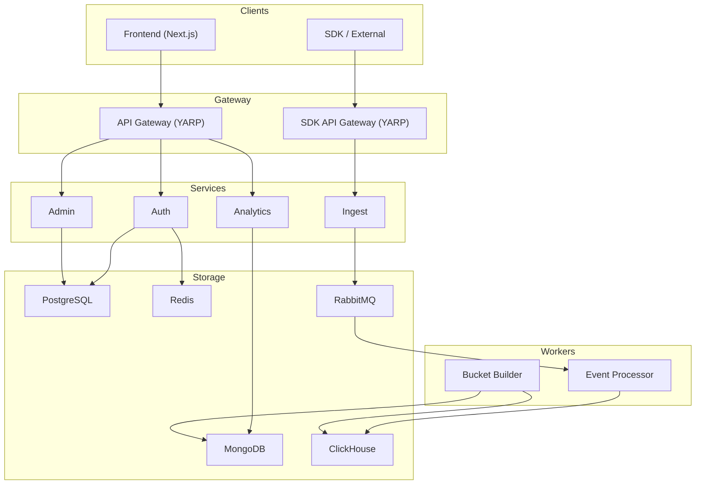

  <picture>
    <source media="(prefers-color-scheme: dark)" srcset="docs/logo-light.svg" />
    <source media="(prefers-color-scheme: light)" srcset="docs/logo-dark.svg" />
    
  </picture>

  Process mining  analytics platform

---

## Description

Enma turns raw event streams into actionable process intelligence. Connect any system through a lightweight SDK, and Enma automatically discovers how your business processes actually run — not how they were designed on paper.

**See what's really happening.** Interactive flow graphs reconstruct end-to-end process paths from real data. Spot bottlenecks, unexpected loops, and deviation patterns that traditional monitoring tools miss.

**Measure what matters.** Time trend analysis, conversion funnels, actor breakdowns, and entry/exit metrics give you a complete picture of process performance — from high-level KPIs down to individual event traces.

**Built for scale.** A high-throughput ingestion pipeline powered by ClickHouse and RabbitMQ handles millions of events without breaking a sweat. Enma grows with your data, not against it.

**Multi-tenant by design.** Organizations, projects, teams, role-based access, and API key management — everything you need to run process mining across departments or serve it as a platform.

## Architecture

See [docs/architecture.md](docs/architecture.md) for details.

## Services

| Service | Description | Docs |
|---------|-------------|------|
| **API Gateway** | Reverse proxy, routing, rate limiting | [docs/services/api-gateway.md](docs/services/api-gateway.md) |
| **SDK API Gateway** | SDK-facing reverse proxy for event ingestion | [docs/services/sdk-api-gateway.md](docs/services/sdk-api-gateway.md) |
| **Auth** | Authentication, JWT, OAuth | [docs/services/auth.md](docs/services/auth.md) |
| **Admin** | Organizations, projects, teams, API keys | [docs/services/admin.md](docs/services/admin.md) |
| **Analytics** | Time trends, funnels, flow graphs | [docs/services/analytics.md](docs/services/analytics.md) |
| **Ingest** | Event ingestion from SDKs | [docs/services/ingest.md](docs/services/ingest.md) |
| **Event Processor** | Event processing and persistence to ClickHouse | [docs/services/event-processor.md](docs/services/event-processor.md) |
| **Bucket Builder** | Analytical bucket aggregation | [docs/services/bucket-builder.md](docs/services/bucket-builder.md) |
| **Frontend** | Next.js UI | [frontend/README.md](frontend/README.md) |

## Tech Stack

**Backend:** .NET 9, Entity Framework Core, MassTransit, YARP, Quartz
**Frontend:** Next.js 16, React 19, TypeScript, Tailwind CSS 4, TanStack Query, XYFlow
**Infra:** PostgreSQL, MongoDB, ClickHouse, Redis, RabbitMQ
**Deploy:** Docker Compose

## Getting Started

See [docs/getting-started.md](docs/getting-started.md)

## Deployment

See [docs/deployment.md](docs/deployment.md)
