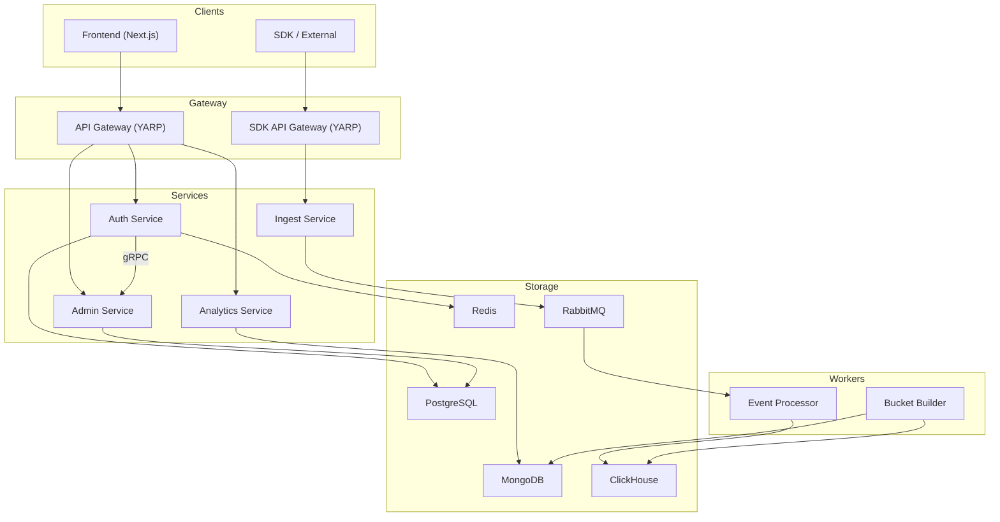

# Architecture

## Overview

Enma is a microservice-based process mining platform. The system ingests events from external SDKs, processes them in real time, and provides analytics through a web interface.

## Service Interaction Diagram

## Data Flows

### Authentication

1. User logs in via Frontend → API Gateway → Auth Service
2. Auth issues JWT (access_token + refresh_token) as HttpOnly cookies
3. API Gateway extracts access_token from cookie and forwards it as `Authorization: Bearer` header
4. Each service validates the JWT independently (symmetric key)

### Event Ingestion

1. SDK sends an event batch → SDK API Gateway → Ingest Service
2. Ingest publishes events to RabbitMQ
3. Event Processor consumes events and writes them to ClickHouse

### Analytics

1. Bucket Builder periodically (Quartz) reads raw data from MongoDB and builds aggregates in ClickHouse
2. Analytics Service reads from MongoDB and serves data for visualization

## Infra

| Infra          | Purpose |
|----------------|---------|
| **PostgreSQL** | Organizations, projects, users, API keys (Admin, Auth) |
| **MongoDB**    | Analytics data, aggregations (Analytics, Bucket Builder) |
| **ClickHouse** | OLAP event storage (Event Processor, Bucket Builder) |
| **Redis**      | Session and token cache (Auth) |
| **RabbitMQ**   | Event queue between Ingest and Event Processor (MassTransit) |

